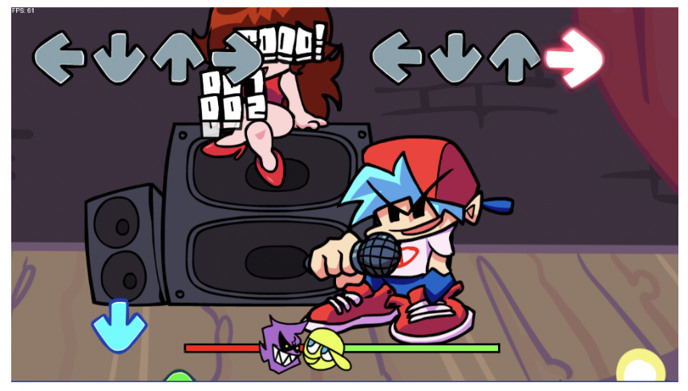
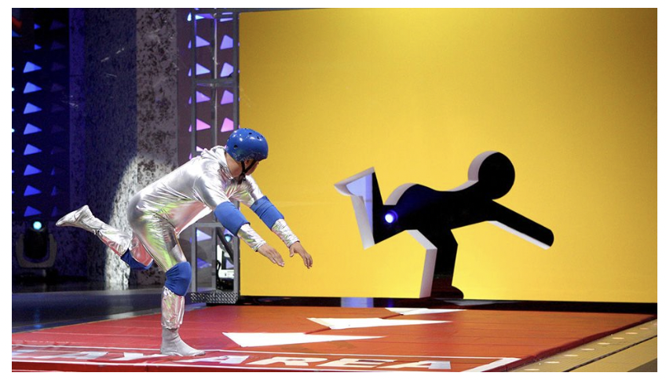
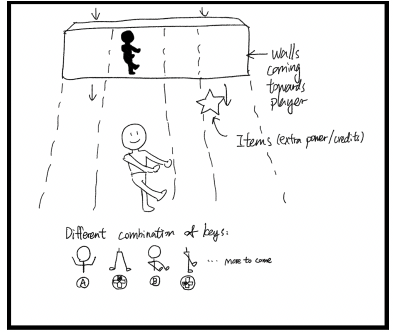
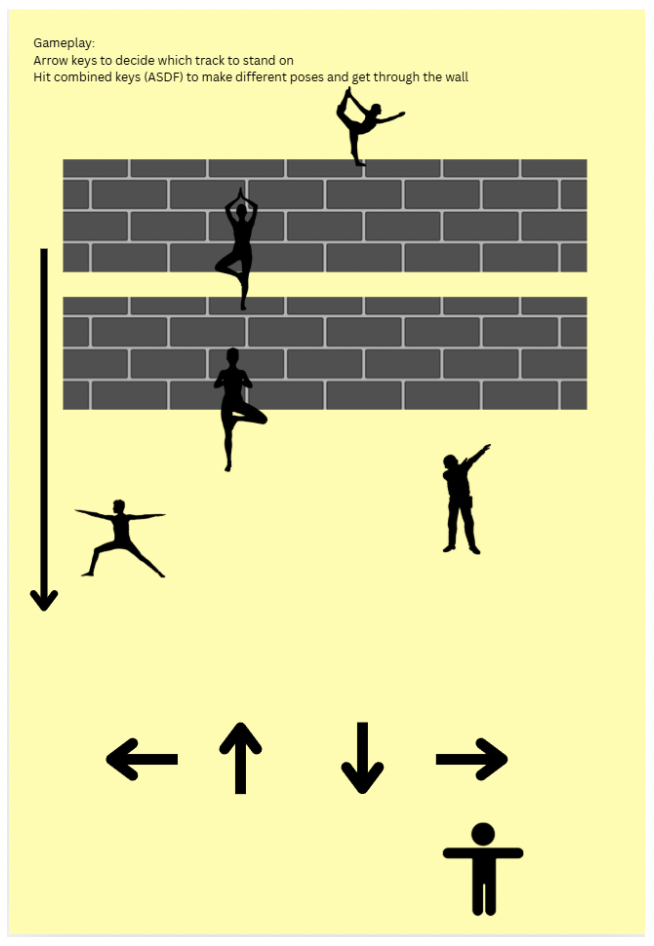
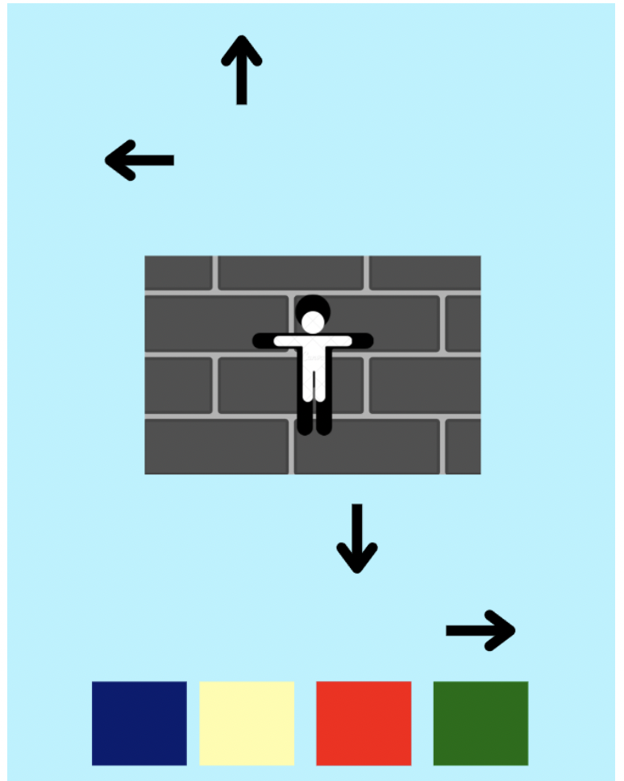
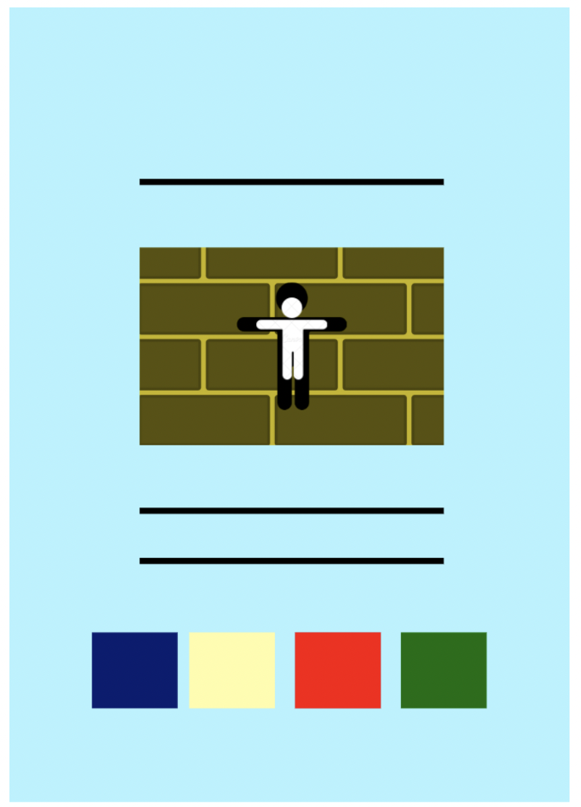
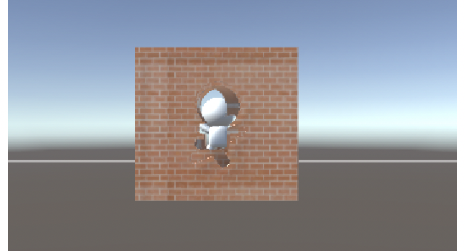

# IM-UH 2320 Game and Play  
**Dr. Domna Banakou**  
**Rhythm Game: FALL'in Line**  
**Group Members:** Rebecca Xiong, Rashed Alshamsi, Buka Enkhjargal, Khaleeqa Aasiyah Garrett  
 

---

## Project Description

### Overall Concept and Theme Interpretation

**[FALL'in Line]** is a rhythm-based action game that creatively blends elements from the rhythm game *Friday Night Funkin’* and the physical challenge TV show *Hole in the Wall*. The result is an engaging, fast-paced experience in which the player controls a character who is falling from the sky and must strike specific poses to fit through incoming wall obstacles.

The game explores the theme of rhythm and flow, not only through its musical structure but also through the fluid motion of the character as they fall. By combining musical timing with body positioning, the game emphasizes both auditory and spatial awareness, making rhythm not just something you hear—but something you do.

[Demo Video](https://youtu.be/8BertM4Lg_4?si=efbFkUbdS5QdwB4v)

  

  

---

## Process and Implementation

### Initial Concept

  

Our first iteration aimed to create a 3D game where a character remains in a fixed position while walls move toward them. The player would use joysticks to hit key combinations and match the wall shapes. However, we quickly realized that this interaction didn’t align well with the rhythm game genre. The disconnection between music and gameplay led to an experience that felt unintuitive and overly complex, with too many button combinations and no rhythm-based feedback.

### Second Iteration

  

We shifted gears to merge visual rhythm elements with the wall poses, attempting to sync falling notes with the carved wall shapes. This led to information overload: the visuals became cluttered, and players struggled to track both incoming walls and rhythm notes. Because the rhythm layer already carried all the necessary information, the background walls became redundant, confusing players rather than enhancing the experience.

### Third Iteration

  

The breakthrough came in the third iteration, where we reimagined the setting as a character falling from the sky. By rotating the camera to a top-down view, we created a more immersive experience. Now, walls appear below the player, and the timing of poses aligns with musical beats. We added a score and multiplier system, rewarding players for precision and consistency. This dramatically improved engagement and encouraged replayability.

### Fourth and Final Iteration

  

In the fourth and most refined version of the game, we resolved our biggest challenge: distributing information in a readable, intuitive way. We removed the arrow keys and added color-coded walls, enabling players to identify the correct pose quickly. The falling lines now indicate rhythm timing, bridging the gap between visual input and gameplay mechanics. A combo system was added to further gamify the experience— if a note is missed, the combo tracker would be reset. If no note is missed, the combos and score multipliers would increase and give more awards to the player, which encourages the player to be focused.

### Technical Methodology

We used a C# script to do the mapping of the notes: when in mapping mode, we hit keys according to the music, the script will document the timing and pressed key, and generate a JSON file that stores the data. Later, we use another C# script to read the JSON file and spawn the notes according to the data. We also use this script to spawn walls and control their speed to ensure that the wall runs into the figure at the exact time when the falling line hits the buttons. To optimize the gaming experience after the game is compiled, we store the JSON files in the /StreamingAssets folder to prioritize them when the game is loaded.

---

## Playtest Assessment

  

We conducted several playtest sessions and captured videos throughout the development process. Playtesting helped us not only refine game mechanics but also significantly improve the user interface and visual design.

One of the earliest insights we gained was the difficulty players had distinguishing wall shapes when all walls were the same color. This led to the decision to color-code wall shapes, which made them more readable and intuitive. It also helped reduce the cognitive load during gameplay, as players could now quickly associate colors with specific actions.

Another key takeaway was pacing. Players struggled when the rhythm was too fast or when controls were too complex. In response, we slowed the rhythm, simplified input mapping, and adjusted the gameplay tempo to make it accessible to a broader audience without compromising challenge.

We also received feedback on visual clarity and immersion. The camera angle was moved from below the figure to above it, enhancing spatial orientation. To simulate the falling experience, we added visual cues like flying birds, and rather than physically moving the character, we used a fixed model with a ragdoll-style falling animation. Although we experimented with Unity’s ragdoll system for realism, it proved unstable. We ultimately chose a controlled animation to synchronize better with rhythm-based gameplay.

---

## Reflection and Evaluation
Our goal was to create a unique game that mixed action and rhythm, and we feel like we’ve accomplished that. The game is fun, visually engaging, and ties the music into the gameplay in a way that feels natural.

At first, we had some pretty ambitious ideas, but they didn’t always fit together well. The gameplay was too complicated and is also not feasible. It wasn’t until we started getting feedback and iterating that we found the right balance between gameplay and visuals. One big change was moving away from using arrows and instead using color-coded wall cutouts, which made the rhythm-based inputs a lot clearer and easier to follow. The biggest challenge was figuring out how to merge our different visions for the game. We all had our own ideas about what the game should look and feel like, and it took a lot of communication and compromise to agree on the final design. This process really helped us improve our teamwork and design skills. We took references from the existing rhythm games like Taiko no Tatsujin, Guitar Hero and Rhythm Heaven to figure out how to distribute the information to the split parts in our game to make it still interesting while being unique.

We’re proud of how the game turned out, especially how it blends rhythm with action. The scoring and combo system gives the player senses of achievement, and the visual cues really help players stay in sync with the music.

We also have great space for progress so far, these are things we would like to implement for further development:

- HP system: The HP slowly increases by nature, and would decrease greatly when the player misses a note. When the player loses all HP, the game ends.
- Special notes: special notes and walls either require special inputs (like long press or quick hits within a period) or give special effects like increasing HP, which would add diversity to gameplay to a great extent.
- More difficulty levels
- Camera effects, to create a stronger illusion of falling
- More soundtracks
- More sound effects

---

## Game as Meaningful Play

  

“FALL'in Line” embodies meaningful play by merging abstract musical timing with concrete physical actions. In doing so, it transforms rhythm from something auditory into something kinesthetic and visual.

At its core, the game serves as a metaphor for the alignment of timing, motion, and thought. The falling character represents the human journey through structured challenges. Each wall is a test, and each successful pose is a moment of harmony between chaos (falling) and order (the music).

Through this mechanic, we explore how rhythm can create a sense of control amidst disorientation, and how gameplay can simulate real human experiences, like adapting to fast-changing situations or syncing with external expectations (the beat).

Feedback from playtesters emphasized how satisfying it felt when a player “got into the flow.” That moment, when a player hits the right pose at the right time and sees their multiplier skyrocket, is more than a game mechanic. It’s a moment of meaningful play where skill, feedback, and narrative align.

We see this game not only as entertainment but also as an invitation to feel rhythm as an immersive, embodied experience—one that engages players’ timing, perception, and motor coordination in a unique and memorable way.

---

